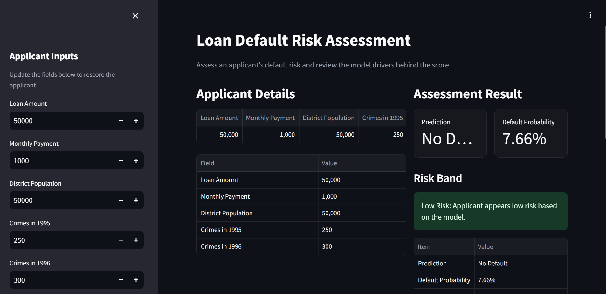
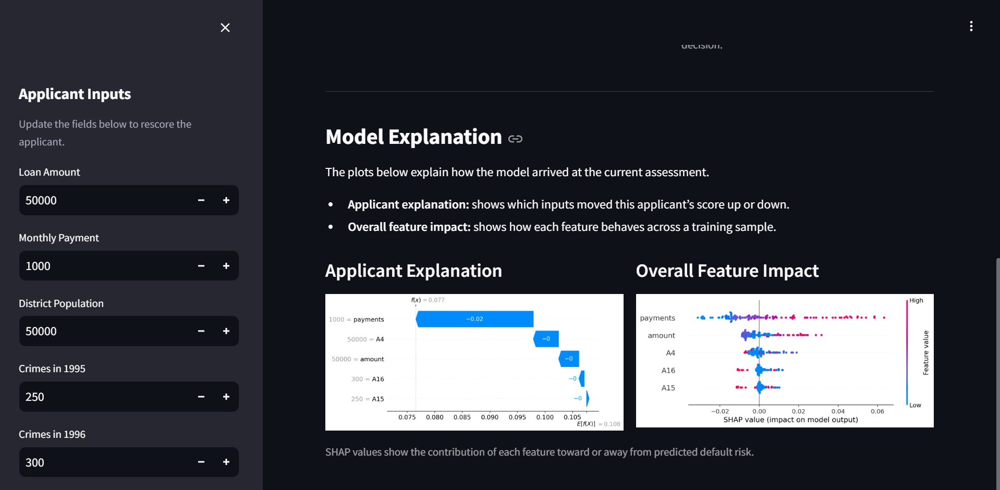

# Loan Default Prediction System with SHAP Explainability

End-to-end credit underwriting project: predicts loan default risk from customer, loan, district, and banking data (Czech financial dataset). Includes a training pipeline, SHAP explainability, a Streamlit dashboard, a FastAPI inference service, Docker containerization, AWS EC2 deployment, and load-testing evidence.

## Live Demo
- **AWS EC2 (primary):** http://13.53.125.154:8501
- **Streamlit Cloud (fallback):** https://loan-default-end-to-end-prediction-system-g6wlk74appi6gwvxjzee.streamlit.app/

> EC2 IP may change if the instance is stopped/restarted without an Elastic IP.

## Dashboard Preview

### Risk Assessment View



### SHAP Explanation View



## What It Does
Binary classification (`0` = No Default, `1` = Default) using SVC on 5 engineered features: `amount`, `payments`, `A4`, `A15`, `A16`. Predictions are explained with SHAP (waterfall + beeswarm), served via a Streamlit dashboard for humans and a FastAPI endpoint for programmatic scoring.

## Model Metrics
Stratified 70/30 split, `random_state=42`:

| Metric | Value |
|---|---:|
| Accuracy | 69.76% |
| Default-class precision | 21.74% |
| Default-class recall | 65.22% |

Full report: [`reports/model_metrics.json`](reports/model_metrics.json). Reproduce with `python src/pipelines/evaluate.py`.

A leakage-safe transaction-feature model was also tested (94.6% accuracy, 87.5% precision, 60.9% recall) but is **not** wired into the deployed dashboard — see `reports/` for details. The deployed model should be treated as a prototype, not a production-grade decisioning system, given its low default-class precision.

## Run Locally
```bash
git clone https://github.com/pruzide/loan-default-end-to-end-prediction-system.git
cd loan-default-end-to-end-prediction-system
pip install -r requirements.txt

streamlit run app.py                                    # dashboard → localhost:8501
uvicorn src.inference.api:app --host 0.0.0.0 --port 8000 # API → localhost:8000
```

## Docker
```bash
docker compose up --build
```
Runs `webapp` (Streamlit, :8501) and `inference-api` (FastAPI, :8000) as separate services sharing the same model artifact.

## AWS EC2 Deployment
Deployed on Ubuntu 22.04 + Docker Compose on EC2. Full steps: [`deploy/AWS_EC2.md`](deploy/AWS_EC2.md).

## Load Testing
25 concurrent users against the FastAPI `/predict` endpoint on EC2:

| Metric | Value |
|---|---:|
| Requests | 250 (0 failed) |
| Throughput | 65.83 req/s |
| p50 latency | 0.36 sec |
| p95 latency | 0.43 sec |
| p95 < 2s target | PASS |

Full report: [`reports/load_test_results.md`](reports/load_test_results.md). Re-run with `python tests/load_test.py --url <url>/predict --concurrency 25 --requests 250`.

## Tech Stack
Python 3.10 · pandas · scikit-learn · SHAP · Streamlit · FastAPI · Docker / Docker Compose · AWS EC2

## Limitations
- Deployed dashboard uses the baseline 5-feature model, not the higher-accuracy transaction-feature model.
- Low default-class precision — prototype-grade, not production-grade.
- No auth, request logging, or drift monitoring yet.

## License
MIT